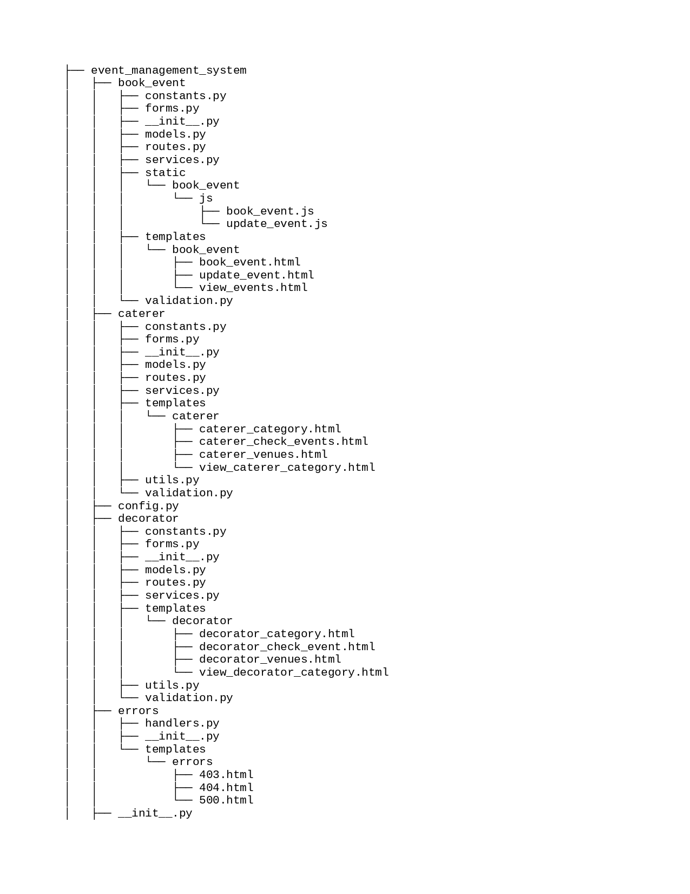
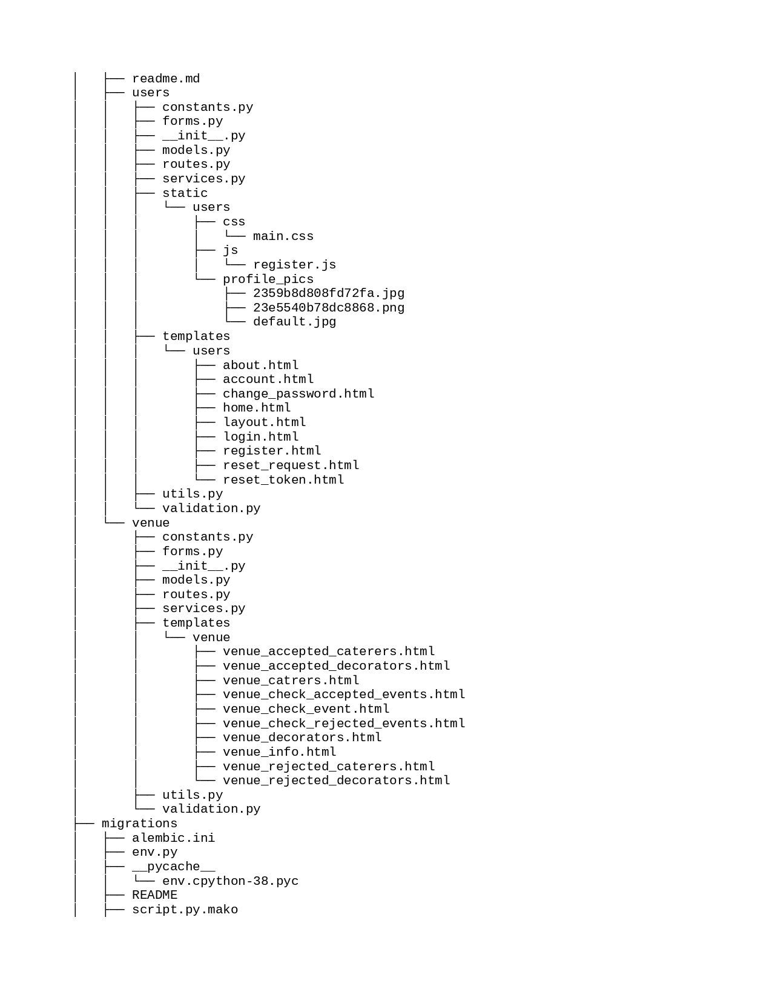
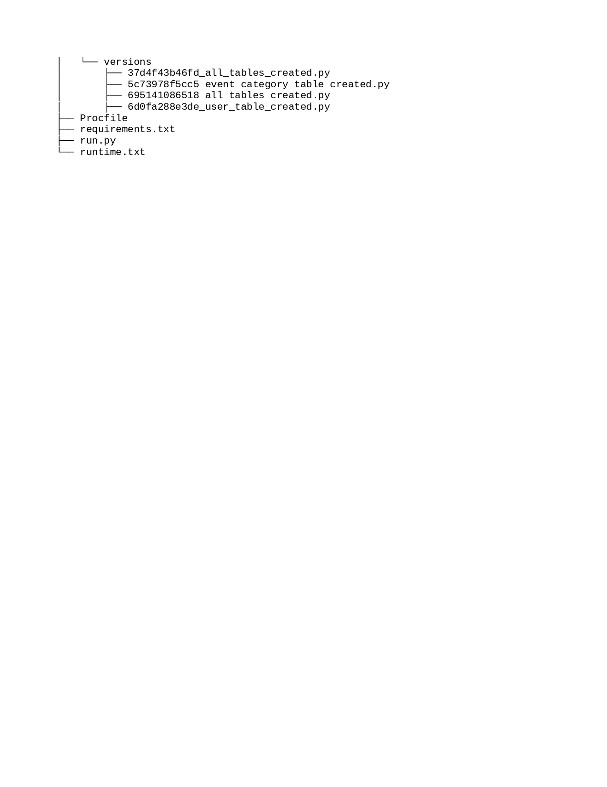

# Flask Best Practices Project Structure

***
To achieve best practices project structure in Flask, I created one project called EventManagementSystem.
In this project, I broke every module in different files based on their functionality. To achieve different modules in
project I used blueprints.

***

## Features

- Encrypted user authorization
- Database initialization
- New user registration
- User Type can be User/Venue/Caterer/Decorator
- User login/logout
- User Account settings
- Venue can add/update Venue capacity and Venue charge
- Decorator and Caterer can add/update/delete category with charges
- Decorator and Caterer can request Venue for business deal
- Venue can approve/reject Decorator/Caterer's business request
- User can book/update/delete event with his/her choice of Venue
- User can further select decorator and caterer listed under selected venue
- Venue accepts/rejects booking request made by user

***

## Setup

``` 
git clone https://github.com/Ishika101100/Event_Management_System.git
cd Event_Management_System
pip install -r requirements.txt
python run.py
```

It should throw errors for database as we have not yet integrated database with it. So let's do that.

### 1. Install Postgres

sudo sh -c 'echo "deb http://apt.postgresql.org/pub/repos/apt $(lsb_release -cs)-pgdg main" >
/etc/apt/sources.list.d/pgdg.list'
wget --quiet -O - https://www.postgresql.org/media/keys/ACCC4CF8.asc | sudo apt-key add
sudo apt-get update
sudo apt-get -y install postgresql # You can define specific version here

Please refer these links for more information

    https://www.postgresql.org/download/linux/ubuntu/	
    https://www.digitalocean.com/community/tutorials/how-to-install-and-use-postgresql-on-ubuntu-18-04

***

### 2 .Creating a database

* You should be able to create a database in postgres using createdb command, the database name you can keep it as you
  want. This database connection details is to be stored in .env file where we will store secrets. This file is in
  gitognore (What's the meaning of adding it in git, It's Top secret ;) )

``` 
DEVELOPMENT_DB_URL='postgresql://{POSTGRES_USER}:{POSTGRES_PASSWORD}@{POSTGRES_SERVER}:{POSTGRES_PORT}/{DATABASE_NAME}'
```

***

### 3 .Set below variable

* You can set this variable directly to your terminal(you need to set it with every new terminal)
* or you can set it in .env file
* for information about debug mode https://blog.miguelgrinberg.com/post/the-flask-mega-tutorial-part-vii-error-handling
  in this refer Debug Mode part
* Also set all required variable(shown in .exapmle-env) in .env

``` 
export FLASK_APP=run.py
export BLOG_ENV=development
export FLASK_DEBUG=True
```

***

### 4 .Migration

* In Detail It has given below.
* Run migrations command to migrate our models(Flask-Migrate Expalin below)
* Optinally, You can define db.create_all() in your application context like below

***

### 5 .Run Below command in terminal

``` 
flask run
```

***


# Packages Used
### Flask

- <a href="https://flask.palletsprojects.com/en/2.1.x/" target="_blank">Package Link</a>
- Flask is a micro web framework written in Python. 
- It is classified as a microframework because it does not require particular tools or libraries. 

### Flask-SQLAlchemy

- <a href="https://flask-sqlalchemy.palletsprojects.com/en/2.x/" target="_blank">Package Link</a>
- It provides support for SQLAlchemy and ORM using SQL databases like sqlite, mysql, postgres, oracle.

### Flask-Migrate

- <a href="https://flask-migrate.readthedocs.io/en/latest/" target="_blank">Package Link</a>
- Flask-Migrate is an extension that handles SQLAlchemy database migrations for Flask applications using Alembic.

### Flask-Bcrypt

- <a href="https://flask-bcrypt.readthedocs.io/en/latest/" target="_blank">Package Link</a>
- It is used to serializing and deserialize

### python-dotenv

- <a href="https://pypi.org/project/python-dotenv/" target="_blank">Package Link</a>
- It would be annoying to set environment variables every time we open our terminal, so we can set environment variables in a local file called .env instead and grab those variables using a Python library like python-dotenv.


# Database and Migration

## Flask-SQLAlchemy

- For most of the relational database(in our case postgresql) connection in a flask application we can use
  Flask-SQLAlchemy Package.
- It provides support for sqlalchemy and ORM using SQL databases like sqlite, mysql, postgres, oracle.
- It also provides support for ORM.

- For creating tables from models we have a command

``` 
from yourapplication import db
db.create_all()
```

- But, we can include in our code itself, so if we add any new model it will automatically create it. In __init__.py
  file inside application context:
- Now, If we have any small change like add a field or remove a field, we can use Flask-Migrate package.
- Because db.create_all() what simply do is , it creates table if it is not already present in DB.

## Flask-Migrate

- To use it we have very simple step as below:

```
  flask db init
  flask db migrate -m "Message related to change"
  flask db upgrade
```

- First command will create a directory named Migrations. That need to be on version control, to detect every change in
  the future.
- Second command will create a python script(you can see it inside migrations/versions directory) that refers to the
  changes. That also needs to be on version control.
- Third will update the latest changes on to the database.
- Alembic has some drawbacks.
- if you check your versions file, you can see one comment in upgrade and downgrade function as below (commands auto
  generated by Alembic - please adjust!):
- When you change type or size of any field flask-migrate will not detect it. So, for that we have one solution.
- https://stackoverflow.com/a/58539794
- We have to add compare_type = True in context.configure() of env.py inside migration folder in both function named
  run_migrations_online and run_migrations_offline. For example:
- Note:if you are facing issue like , you run the migration but your tables are not detected then import your all models
  in env.py:

## Project Tree





# Layer wise structure

***

### List of common layers in any module

1. routes
2. services
3. forms
4. models
5. validation
6. utils
7. constants

### 1. Routes

***

- in this layer we defined our routes endpoints and set blueprint.
- Views only interacts with service.
- Do not write any business logic in this layer.

### 2. service

***

- This layer is a middleware between views and all other layer.Service layer just call the other layer's method or
  function and pass the results to the other layer.
- All layer is separated from each other except service. service can interact with all others layer, so it's middleware
  between all layers.

### 3. Forms

***

- Work of this layer is to interact with service layer.
- WTF is used to manage forms.
- WTF stands for WT Forms that help in providing an interactive user interface.
- WTForms are the flexible forms with validation and rendering library.
- With WTForms, you can define the form fields in Python script, and then you can render them using an HTML template.
- Apart from these cool features, WTForms provides these below-mentioned features also because of which it is very
  helpful to use this module.

### 4. model or database

***

- Model is a class within the Flask-SQLAlchemy project. Flask-SQLAlchemy makes it easier to use SQLAlchemy within a
  Flask application. SQLAlchemy is used to read, write, query and delete persistent data in a relational database
  through SQL or the object-relational mapper (ORM) interface built into the project.

### 5. validation

***

* This layer communicates only with service layer
* All kind of validation logic must come under this layer.

### 6. utils

***

* This file contains the collection of small Python functions and classes which make common patterns shorter and easier.
* It is by no means a complete collection, but it has served me quite a bit in the past and I will keep extending it.
* One of the method make in this is sendmail.

### 7.constants

***

* The App level constants are defined in here, right now we preferred to put all string constants in the single file so
  if we need to do multilingual app it can be useful to have all strings in single place.

## List of Modules in Event Management System

### 1. User

***

* In this module user related CRUD operation can be performed.

### 2. Book Event
***
* In this module Event Booking related CRUD operations can be performed.

### 3. Venue
***
* In this module Venue can accept/reject booking request by user.
* Venue can accept/reject business request from decorator/caterer
* Venue can Update it's capacity and charges
* Venue can see list of events conducted at its premises.

### 4. Decorator
***
* In this module Decorator can add, update and delete decoration category and it's charges.
* Decorator can request venue for business deal
* Decorator can see list of event where he has provided service

### 5. Caterer
***
* In this module Caterer can add, update and delete food category and it's charges.
* Caterer can request venue for business deal
* Caterer can see list of event where he has provided service


